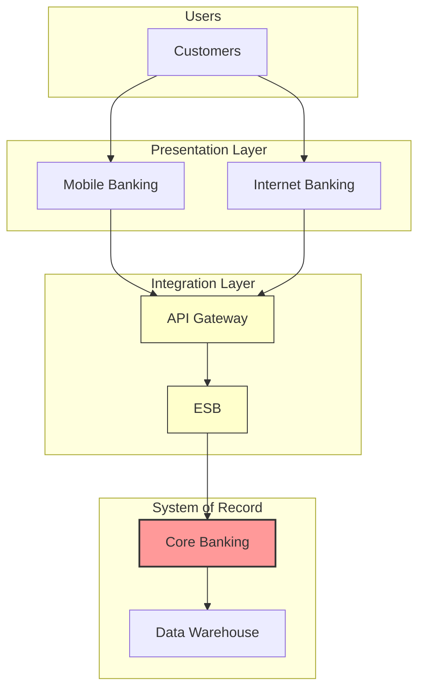

# System Architecture Diagram

This diagram illustrates the high-level flow of data and interactions between the core applications, based on the `application_inventory.csv` and assumed data flows.

## Mermaid Diagram Code

 
### Explanation of Components:
*   **Customers:** The end-users initiating transactions.
*   **Mobile Banking / Internet Banking:** The primary user-facing touchpoints.
*   **API Gateway:** The single entry point for all external API calls, handling authentication and routing.
*   **ESB:** The Enterprise Service Bus, responsible for orchestrating and transforming messages between services.
*   **Core Banking:** The authoritative system of record for all financial transactions.
*   **Data Warehouse:** The centralized repository for aggregated data used for analytics and reporting.

This diagram models the flow from the user interface, through the integration layers, down to the core systems, and finally into the data layer.
