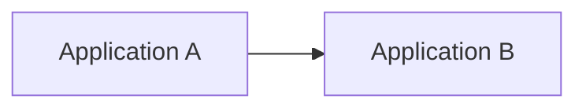
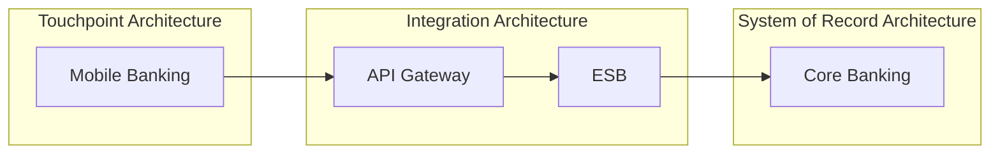

# Diagramming Guideline

## 1. Purpose

This guideline defines how to create clear, consistent, and reviewable architecture diagrams in Markdown using Mermaid.

## 2. Diagram Principles

Good EA diagrams should be:

- understandable by non-builders
- focused on a specific question
- traceable to inventory
- clear about boundaries
- not overloaded with unnecessary labels
- safe to store in repository

## 3. Recommended Diagram Types

| Diagram | Use When |
|---|---|
| Context Diagram | Explain system in its environment |
| Application Integration Diagram | Show application-to-application dependencies |
| Data Flow Diagram | Show sensitive data movement |
| Deployment Diagram | Show runtime and infrastructure view |
| Sequence Diagram | Show transaction or process flow |
| Capability Map | Show business capability coverage |

## 4. Mermaid Standard

Use Mermaid code blocks inside Markdown:

## 5. EA Domain Grouping

For integration diagrams, group nodes where possible:

- Touchpoint Architecture
- Integration Architecture
- System of Record Architecture
- Data / Analytics Architecture
- Security Architecture
- Infrastructure Architecture

Example:

## 6. Naming Rules

| Rule | Example |
|---|---|
| Use business-recognizable names | `Mobile Banking` |
| Avoid internal hostnames | Do not use server names unless required |
| Avoid IP addresses | Prefer logical system names |
| Keep labels short | `HTTPS/REST` instead of long sentences |
| Use consistent abbreviations | `API Gateway`, not mixed forms |

## 7. Sensitive Information

Do not include:

- passwords
- tokens
- secrets
- private keys
- customer data
- internal IPs unless approved
- severe vulnerability details
- firewall rules that expose sensitive posture

## 8. Diagram Review Checklist

- [ ] Diagram has a clear purpose
- [ ] Systems exist in inventory
- [ ] Direction of dependency is clear
- [ ] Sensitive data movement is indicated where relevant
- [ ] Critical dependencies are visible
- [ ] Mermaid syntax renders correctly
- [ ] Assumptions are documented
