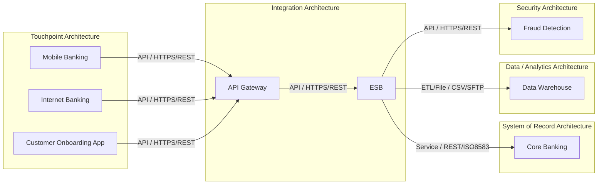

# Application Integration Diagram

## Summary

The integration landscape contains 8 applications connected by 7 documented integrations. Customer touchpoints route real-time API traffic through API Gateway into ESB. ESB is the central integration layer for Core Banking, Data Warehouse, and Fraud Detection. One Customer Onboarding App flow is marked Proposed.

## Mermaid Diagram

## Critical Dependencies

| Dependency | Reason |
|---|---|
| ESB → Core Banking | Critical Service integration using REST/ISO8583 for Financial transaction. |
| ESB as central integration layer | ESB is the source for Core Banking, Data Warehouse, and Fraud Detection integrations, including one Critical dependency. |
| API Gateway as customer channel entry point | Mobile Banking, Internet Banking, and Customer Onboarding App route to API Gateway using HTTPS/REST. |
| API Gateway → ESB | High criticality real-time gateway-to-middleware dependency for validated transaction requests. |

## Integration Risks

| Risk | Severity | Recommendation |
|---|---|---|
| ESB concentration risk | High | Validate resilience, monitoring, failover, and recovery plan for ESB-dependent flows. |
| Critical core transaction dependency | Critical | Confirm service objectives, error handling, and recovery procedures for ESB to Core Banking. |
| Proposed onboarding flow not yet active | Medium | Review Customer Onboarding App integration controls before promoting the proposed API flow. |
| Batch analytics dependency | Medium | Confirm file transfer controls, reconciliation, and operational ownership for ESB to Data Warehouse. |
| Real-time fraud scoring dependency | High | Confirm timeout, fallback, and monitoring behavior for ESB to Fraud Detection. |

## Inventory Gaps

| Gap | Impact |
|---|---|
| No unknown application references in integration inventory | All source and target applications are present in the application inventory. |
| No blank core integration fields found | Source, target, type, protocol, frequency, criticality, owner, and status are populated for all integration records. |
| No explicit SLA, RTO/RPO, volume, timeout, retry, or error-handling fields | Operational resilience and performance risk cannot be fully assessed from the inventory. |
| No per-integration authentication or authorization field | Security pattern validation depends on application-level authentication data or separate design evidence. |
| No per-integration data classification field | Data protection controls must be inferred from application/data inventories or confirmed separately. |

## Assumptions

- The diagram includes only applications listed in the application inventory and referenced by the integration inventory.
- EA domain grouping is taken from `application-inventory.csv`.
- Edge labels use integration type and protocol from `integration-inventory.csv`.
- Integration severity is based on the `criticality` and `status` fields in the integration inventory.
- No secrets, IP addresses, credentials, databases, vendors, or protocols beyond the input files are included.
