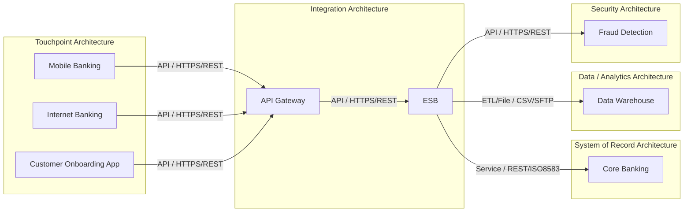

# Application Integration Diagram

## Summary

The integration inventory documents 7 integrations across 8 applications. Customer-facing channels connect to API Gateway over HTTPS/REST, API Gateway routes validated transaction requests to ESB, and ESB connects to Core Banking, Data Warehouse, and Fraud Detection. Customer Onboarding App is included as a proposed HTTPS/REST flow to API Gateway.

## Mermaid Diagram

## Critical Dependencies

| Dependency | Reason |
|---|---|
| ESB → Core Banking | Critical Service integration using REST/ISO8583 for Financial transaction. |
| ESB as central integration layer | ESB is the source for Core Banking, Data Warehouse, and Fraud Detection integrations. |
| API Gateway as channel entry point | Mobile Banking, Internet Banking, and Customer Onboarding App connect to API Gateway. |
| API Gateway → ESB | High criticality real-time gateway-to-middleware dependency for validated transaction requests. |

## Integration Risks

| Risk | Severity | Recommendation |
|---|---|---|
| ESB concentration risk | High | Validate ESB monitoring, capacity, failover, and recovery controls for downstream dependencies. |
| Critical core transaction dependency | Critical | Confirm service objectives, timeout handling, error handling, and recovery procedures for ESB to Core Banking. |
| Proposed onboarding flow | Medium | Complete architecture, privacy, and operational review before activating Customer Onboarding App integration. |
| Batch analytics feed dependency | Medium | Confirm CSV/SFTP transfer controls, reconciliation, ownership, and failure handling for ESB to Data Warehouse. |
| Real-time fraud scoring dependency | High | Confirm fallback behavior, monitoring, timeout policy, and incident handling for ESB to Fraud Detection. |

## Inventory Gaps

| Gap | Impact |
|---|---|
| No unknown application references | All integration source and target applications exist in the application inventory. |
| No blank core integration fields | Source, target, type, protocol, data subject, frequency, criticality, owner, and status are populated for all integrations. |
| No SLA, RTO/RPO, throughput, retry, timeout, or error-handling fields | Resilience and performance cannot be fully assessed from the inventory. |
| No per-integration authentication or authorization field | Security control validation requires separate evidence or application-level authentication mapping. |
| No per-integration data classification field | Data protection controls must be inferred from application/data inventories or confirmed separately. |

## Assumptions

- The diagram uses only applications listed in `application-inventory.csv` and referenced in `integration-inventory.csv`.
- EA domain grouping is taken from the `ea_domain` field in `application-inventory.csv`.
- Mermaid edge labels use only `integration_type` and `protocol` from `integration-inventory.csv`.
- Critical dependency severity is based on the `criticality` field in the integration inventory.
- Proposed integrations are shown because they are present in the input file, with status retained in the narrative and risks.
- No secrets, IP addresses, credentials, databases, middleware products beyond named applications, vendors, or protocols outside the input files are included.
